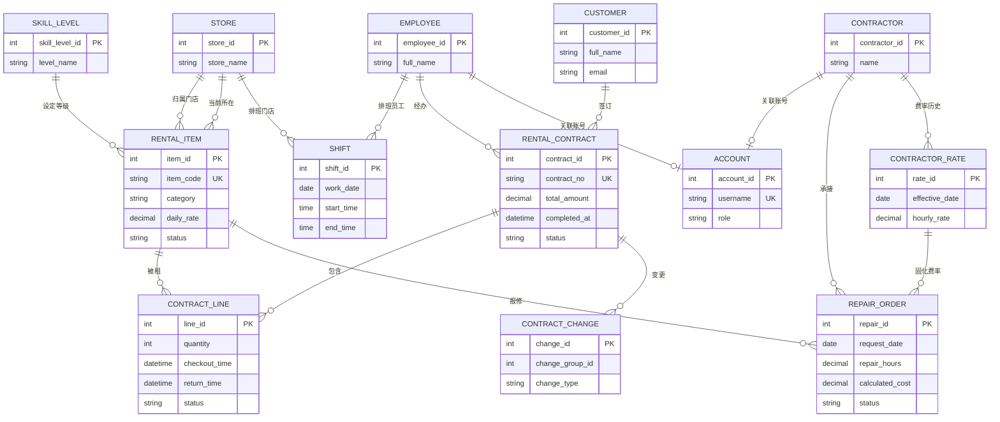

# 案例 01 · 雪峰滑雪租赁管理系统 — 数据设计

> 本文档输出 ER 图、关系模式、数据字典与权限矩阵，是《系统分析与设计》课程的核心教学材料。
> 关系模式为**逻辑模型**（第一版由 DataService 模拟实现）；括号内为对应 PostgreSQL 目标约束，供后续迁移参考。

---

## 1. ER 图（概念模型）



---

## 2. 关系模式（逻辑模型）

> 主键加下划线，外键标注 `→`；`{ }` 内为 PostgreSQL 目标约束。金额为人民币（元），时间精确到分钟。

```
ACCOUNT ( _account_id_, username UNIQUE, password_placeholder, role,
          employee_id NULL → EMPLOYEE, contractor_id NULL → CONTRACTOR, enabled )
          { CHECK (role IN ('admin','staff','contractor')),
            CHECK ( (employee_id IS NOT NULL AND contractor_id IS NULL) OR
                    (employee_id IS NULL AND contractor_id IS NOT NULL) ) }

SKILL_LEVEL ( _skill_level_id_, level_name UNIQUE, sort_order )

STORE ( _store_id_, store_name, address, phone )

CUSTOMER ( _customer_id_, full_name, address, phone,
           email UNIQUE NULL, birth_year NULL, height_cm NULL,
           weight_kg NULL, shoe_size NULL )

EMPLOYEE ( _employee_id_, full_name, address, phone, email, notes NULL )

RENTAL_ITEM ( _item_id_, item_code UNIQUE, name, description, category,
              purchase_date, purchase_cost, retail_price, daily_rate,
              skill_level_id NULL → SKILL_LEVEL,
              home_store_id → STORE, current_store_id → STORE, status )
              { CHECK (purchase_cost >= 0), CHECK (daily_rate >= 0),
                CHECK (status IN ('在库','借出中','维修中','已报废')) }

CONTRACTOR ( _contractor_id_, name, address, phone, email )

CONTRACTOR_RATE ( _rate_id_, contractor_id → CONTRACTOR,
                  effective_date, hourly_rate,
                  UNIQUE (contractor_id, effective_date) )
                  { CHECK (hourly_rate > 0) }

RENTAL_CONTRACT ( _contract_id_, contract_no UNIQUE, customer_id → CUSTOMER,
                  employee_id → EMPLOYEE, contract_date, duration_days,
                  total_amount, completed_at NULL, status )
                  { CHECK (duration_days > 0), CHECK (total_amount >= 0),
                    CHECK (status IN ('进行中','已完成')),
                    CHECK ((status = '已完成') = (completed_at IS NOT NULL)) }

CONTRACT_LINE ( _contract_line_id_, contract_id → RENTAL_CONTRACT,
                item_id → RENTAL_ITEM, quantity DEFAULT 1, daily_rate,
                checkout_time, checkout_store_id → STORE,
                return_time NULL, return_store_id NULL → STORE, status,
                UNIQUE (contract_id, item_id) )
                { CHECK (quantity = 1),
                  CHECK (status IN ('借出中','已归还','已更换')),
                  CHECK (return_time IS NULL OR return_time > checkout_time) }

CONTRACT_CHANGE ( _change_id_, contract_id → RENTAL_CONTRACT,
                  change_group_id NULL, change_date,
                  change_type, item_id NULL → RENTAL_ITEM, quantity DEFAULT 1,
                  amount_delta NULL, note NULL )
                  { CHECK (change_type IN ('增加','归还')),
                    CHECK (quantity = 1) }

REPAIR_ORDER ( _repair_id_, item_id → RENTAL_ITEM,
               contractor_id → CONTRACTOR, rate_id → CONTRACTOR_RATE,
               request_date, fault_description, repair_date NULL,
               repair_hours NULL, calculated_cost NULL, notes NULL, status )
               { CHECK (status IN ('待维修','维修中','已完成')),
                 CHECK (repair_date IS NULL OR repair_date >= request_date),
                 CHECK (repair_hours IS NULL OR repair_hours > 0),
                 CHECK (repair_hours IS NULL OR (repair_hours*4) % 1 = 0) }

SHIFT ( _shift_id_, employee_id → EMPLOYEE, store_id → STORE,
        work_date, start_time, end_time,
        UNIQUE (employee_id, work_date) )
        { CHECK (start_time < end_time),
          CHECK (start_time >= TIME '08:00' AND end_time <= TIME '22:00') }
```

**设计要点（教学讨论点）：**

1. **真正多对多的分解**：合同↔设备经 `CONTRACT_LINE` 分解；员工↔门店（排班）经 `SHIFT` 分解。**设备↔维修单是 1:N**（一件设备可有多张维修单，每张维修单只对应一件设备），直接以 `REPAIR_ORDER.item_id` 外键实现，无需中间表。
2. **历史费率表**：`CONTRACTOR_RATE` 与 `CONTRACTOR` 分离，`UNIQUE(contractor_id, effective_date)` 保证同一承包商同一日期仅一条费率。
3. **费率固化**：`REPAIR_ORDER.rate_id` 在创建时按生效日期选定，`calculated_cost = repair_hours × hourly_rate` 在完成时固化，费率变更不影响历史账单。
4. **换货审计**：换货拆为"归还旧 + 增加新"两条 `CONTRACT_CHANGE`，共享 `change_group_id`，`amount_delta` 在变更组层面计算一次，避免重复。
5. **派生冗余字段**：`RENTAL_ITEM.status` 可由合同明细与维修单推导，此处冗余存储以简化查询——"规范化 vs 性能"的典型取舍。

---

## 3. 数据字典

### 3.1 ACCOUNT 账号（新增）

| 字段 | 类型 | 约束 | 说明 |
| --- | --- | --- | --- |
| account_id | INT | PK, 自增 | 账号 ID |
| username | VARCHAR(50) | UNIQUE, 非空 | 登录名 |
| password_placeholder | VARCHAR(100) | 非空 | 密码占位（仅教学模拟，非真实凭据） |
| role | VARCHAR(20) | 非空 | admin / staff / contractor |
| employee_id | INT | FK, 可空 | 关联员工（admin/staff 必填其一） |
| contractor_id | INT | FK, 可空 | 关联承包商（contractor 必填其一） |
| enabled | BOOLEAN | 非空 | 是否启用 |

> 约束：`employee_id` 与 `contractor_id` 二者恰有一个非空（角色与业务实体一一对应）。

### 3.2 SKILL_LEVEL 技能等级

| 字段 | 类型 | 约束 | 说明 |
| --- | --- | --- | --- |
| skill_level_id | INT | PK, 自增 | 等级 ID |
| level_name | VARCHAR(20) | UNIQUE, 非空 | 初级 / 中级 / 高级 / 专家+ |
| sort_order | INT | 非空 | 排序号 |

### 3.3 STORE 门店

| 字段 | 类型 | 约束 | 说明 |
| --- | --- | --- | --- |
| store_id | INT | PK, 自增 | 门店 ID |
| store_name | VARCHAR(50) | 非空 | 门店名称 |
| address | VARCHAR(200) | | 地址 |
| phone | VARCHAR(20) | | 电话 |

### 3.4 CUSTOMER 客户

| 字段 | 类型 | 约束 | 说明 |
| --- | --- | --- | --- |
| customer_id | INT | PK, 自增 | 客户 ID |
| full_name | VARCHAR(50) | 非空 | 姓名 |
| address | VARCHAR(200) | | 家庭住址 |
| phone | VARCHAR(20) | | 电话 |
| email | VARCHAR(100) | UNIQUE, 可空 | 邮箱（识别回头客首选） |
| birth_year | INT | 可空 | 出生年份（可估） |
| height_cm | DECIMAL(5,1) | 可空 | 身高（cm） |
| weight_kg | DECIMAL(5,1) | 可空 | 体重（kg） |
| shoe_size | DECIMAL(3,1) | 可空 | 鞋码 |

### 3.5 EMPLOYEE 员工

| 字段 | 类型 | 约束 | 说明 |
| --- | --- | --- | --- |
| employee_id | INT | PK, 自增 | 员工 ID |
| full_name | VARCHAR(50) | 非空 | 全名 |
| address | VARCHAR(200) | | 地址 |
| phone | VARCHAR(20) | | 电话 |
| email | VARCHAR(100) | | 邮箱 |
| notes | VARCHAR(500) | 可空 | 备注（如特长） |

### 3.6 RENTAL_ITEM 租赁物品

| 字段 | 类型 | 约束 | 说明 |
| --- | --- | --- | --- |
| item_id | INT | PK, 自增 | 物品 ID |
| item_code | VARCHAR(20) | UNIQUE, 非空 | 物理库存编号 |
| name | VARCHAR(80) | 非空 | 名称 |
| description | VARCHAR(200) | | 描述 |
| category | VARCHAR(20) | 非空 | 类别：滑雪板/雪靴/雪杖/单板/护目镜/头盔 |
| purchase_date | DATE | | 购入日期 |
| purchase_cost | DECIMAL(10,2) | ≥0 | 购入成本 |
| retail_price | DECIMAL(10,2) | | 零售价 |
| daily_rate | DECIMAL(10,2) | 非空, ≥0 | 日租金 |
| skill_level_id | INT | FK, 可空 | 技能等级（配件为空） |
| home_store_id | INT | FK, 非空 | 归属门店（仅永久调拨时改） |
| current_store_id | INT | FK, 非空 | 当前所在门店（归还/调拨时更新） |
| status | VARCHAR(20) | 非空 | 在库 / 借出中 / 维修中 / 已报废 |

### 3.7 CONTRACTOR 承包商

| 字段 | 类型 | 约束 | 说明 |
| --- | --- | --- | --- |
| contractor_id | INT | PK, 自增 | 承包商 ID |
| name | VARCHAR(80) | 非空 | 名称 |
| address | VARCHAR(200) | | 地址 |
| phone | VARCHAR(20) | | 电话 |
| email | VARCHAR(100) | | 邮箱 |

### 3.8 CONTRACTOR_RATE 承包商费率历史

| 字段 | 类型 | 约束 | 说明 |
| --- | --- | --- | --- |
| rate_id | INT | PK, 自增 | 费率记录 ID |
| contractor_id | INT | FK, 非空 | 承包商 |
| effective_date | DATE | 非空 | 生效日期 |
| hourly_rate | DECIMAL(10,2) | 非空, >0 | 小时费率 |

> 约束：`UNIQUE(contractor_id, effective_date)`。

### 3.9 RENTAL_CONTRACT 租赁合同

| 字段 | 类型 | 约束 | 说明 |
| --- | --- | --- | --- |
| contract_id | INT | PK, 自增 | 合同 ID |
| contract_no | VARCHAR(20) | UNIQUE, 非空 | 合同编号 |
| customer_id | INT | FK, 非空 | 客户 |
| employee_id | INT | FK, 非空 | 经办员工 |
| contract_date | DATE | 非空 | 合同日期 |
| duration_days | INT | 非空, >0 | 租赁时长（天） |
| total_amount | DECIMAL(10,2) | 非空, ≥0 | 最终应收总额（完成时固化） |
| completed_at | DATETIME | 可空 | 合同完成时间（进行中为空；`status='已完成'` 时非空） |
| status | VARCHAR(20) | 非空 | 进行中 / 已完成 |

### 3.10 CONTRACT_LINE 合同明细

| 字段 | 类型 | 约束 | 说明 |
| --- | --- | --- | --- |
| contract_line_id | INT | PK, 自增 | 明细 ID |
| contract_id | INT | FK, 非空 | 合同 |
| item_id | INT | FK, 非空 | 物品（单品） |
| quantity | INT | 恒为 1 | 数量（单品粒度） |
| daily_rate | DECIMAL(10,2) | 非空 | 日租金快照 |
| checkout_time | DATETIME | 非空 | 借出时间 |
| checkout_store_id | INT | FK, 非空 | 借出门店 |
| return_time | DATETIME | 可空 | 归还时间 |
| return_store_id | INT | FK, 可空 | 归还门店 |
| status | VARCHAR(20) | 非空 | 借出中 / 已归还 / 已更换 |

> 约束：`UNIQUE(contract_id, item_id)` 防重复加入；`return_time > checkout_time`。

### 3.11 CONTRACT_CHANGE 合同变更记录

| 字段 | 类型 | 约束 | 说明 |
| --- | --- | --- | --- |
| change_id | INT | PK, 自增 | 变更 ID |
| contract_id | INT | FK, 非空 | 合同 |
| change_group_id | INT | 可空 | 分组号（换货两条记录共享） |
| change_date | DATETIME | 非空 | 变更时间 |
| change_type | VARCHAR(20) | 非空 | 增加 / 归还 |
| item_id | INT | FK, 可空 | 物品 |
| quantity | INT | 恒为 1 | 数量 |
| amount_delta | DECIMAL(10,2) | 可空 | 变更组净差价（组层面计算一次，负数为退款） |
| note | VARCHAR(500) | 可空 | 说明 |

### 3.12 REPAIR_ORDER 维修单

| 字段 | 类型 | 约束 | 说明 |
| --- | --- | --- | --- |
| repair_id | INT | PK, 自增 | 维修单 ID |
| item_id | INT | FK, 非空 | 设备 |
| contractor_id | INT | FK, 非空 | 承包商 |
| rate_id | INT | FK, 非空 | 固化费率（按生效日期选定） |
| request_date | DATE | 非空 | 申请日期 |
| fault_description | VARCHAR(500) | 非空 | 故障描述 |
| repair_date | DATE | 可空 | 维修完成日期 |
| repair_hours | DECIMAL(4,2) | 可空 | 维修时长（0.25 = 15 分钟步进） |
| calculated_cost | DECIMAL(10,2) | 可空 | 维修成本 = repair_hours × hourly_rate |
| notes | VARCHAR(500) | 可空 | 备注 |
| status | VARCHAR(20) | 非空 | 待维修 / 维修中 / 已完成 |

> 状态转换：`待维修 → 维修中 → 已完成`（单向）。

### 3.13 SHIFT 员工排班

| 字段 | 类型 | 约束 | 说明 |
| --- | --- | --- | --- |
| shift_id | INT | PK, 自增 | 排班 ID |
| employee_id | INT | FK, 非空 | 员工 |
| store_id | INT | FK, 非空 | 门店 |
| work_date | DATE | 非空 | 日期 |
| start_time | TIME | 非空 | 开始（08:00–22:00） |
| end_time | TIME | 非空 | 结束 |

> 约束：`UNIQUE(employee_id, work_date)`；`start_time < end_time` 且在 08:00–22:00 内。

### 3.14 引用完整性约束（删除/修改规则）

| 被引用实体 | 引用来源（外键） | 规则 |
| --- | --- | --- |
| 客户 CUSTOMER | rental_contract.customer_id | 被合同引用后不可物理删除 |
| 门店 STORE | rental_item.home/current_store_id、shift.store_id、contract_line.checkout/return_store_id | 被设备、排班或合同明细引用后不可物理删除 |
| 员工 EMPLOYEE | account.employee_id、rental_contract.employee_id、shift.employee_id | 被账号、合同或排班引用后不可物理删除 |
| 承包商 CONTRACTOR | account.contractor_id、contractor_rate.contractor_id、repair_order.contractor_id | 被账号、费率或维修单引用后不可物理删除 |
| 费率 CONTRACTOR_RATE | repair_order.rate_id | 被维修单引用后不可修改或删除 |

> DataService 须在删除/修改前检查上述引用；被引用时拒绝操作并返回**明确失败原因**，界面展示该原因。

---

## 4. 权限矩阵

| 功能 | 管理员(admin) | 店员(staff) | 承包商(contractor) |
| --- | --- | --- | --- |
| 登录 | ✓ | ✓ | ✓ |
| 客户管理 | 增删改查 | 增删改查 | ✗ |
| 设备管理 | 增删改查 | 查看 | ✗ |
| 门店管理 | 增删改查 | ✗ | ✗ |
| 承包商管理 | 增删改查 | ✗ | ✗ |
| 员工与排班 | 增删改查 | ✗ | ✗ |
| 租赁合同 | 增删改查 | 增删改查 | ✗ |
| 借出/换货/归还 | 操作 | 操作 | ✗ |
| 维修单 | 增删改查 | 创建/查看 | 更新本人承接单 |
| 驾驶舱 | 查看全部 | 查看汇总 | ✗ |

> 权限判定依据：由 `ACCOUNT.role` 结合 `ACCOUNT.contractor_id`（承包商仅 `WHERE contractor_id = 本人`）实现。第一版为服务层模拟，非安全边界。
> 补充：店员**不进入**门店/承包商/员工管理页；但店员在创建维修单时可在表单内读取并选择承包商（引用数据，不进入管理页）。

---

## 5. 种子数据方案

为演示完整流程与报表，初始化以下关联数据（全部虚构）：

- **技能等级**：初级、中级、高级、专家+ 共 4 条；
- **门店**：云顶东门店、云顶西门店 共 2 条；
- **员工**：8 名（含总经理、运营主管与轮岗店员）；
- **账号**：admin（关联总经理）、staff（关联店员）、contractor（关联承包商）各 1 个；
- **承包商**：3 家，各含 2 条历史费率；
- **客户**：12 名（含回头客）；
- **设备**：36 件（滑雪板/雪靴/雪杖/单板/护目镜/头盔，雪杖逐对建档；分布于两店，含不同技能等级；含 1–2 件已报废设备）；
- **合同**：15 份（覆盖进行中/已完成/含换货/含退款），明细与变更记录配套；
- **维修单**：10 张（覆盖待维修/维修中/已完成，含固化费率核算）；
- **排班**：近 7 天两店排班记录。

种子数据足以演示：正常流程、换货差价、退款、维修周转、设备利用率、本月营收与门店库存分布报表。
