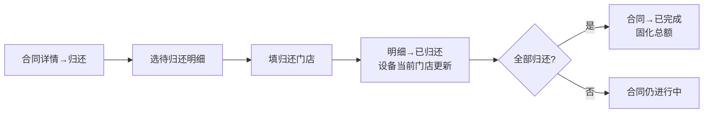
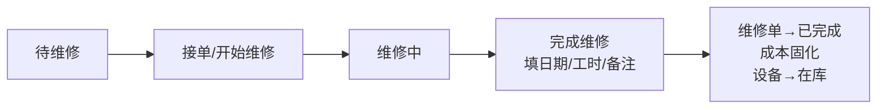

# 案例 01 · 雪峰滑雪租赁管理系统 — 界面设计规范

> 适用范围：第一版单机教学演示系统（桌面端，≥1280px）
> 技术落点：React 18 + TDesign React + ECharts
> 本文档为 UI/UX 设计规范，**不含实现代码**。

---

## 0. 设计规格声明（DESIGN SPECIFICATION）

```
1. Purpose Statement
   面向滑雪门店店员与维修承包商的教学演示型运营后台，需要在课堂投影环境下
   清晰演示"客户→合同→借出→换货→归还→维修"的业务闭环与经营驾驶舱，
   兼顾专业可信度与户外品牌气质。

2. Aesthetic Direction
   Industrial / utilitarian（工业实用主义）·「雪线」主题
   —— 以高山雪线、岩层、松林为视觉隐喻的实用型运营后台。

3. Color Palette（hex）
   主色 松绿 #17402F / 深 #0E2A1F / 浅底 #E8F0EC
   强调 冰川蓝 #17617D / 浅底 #E6F0F4
   中性 文字 #1F2428 / 次级 #5A6268 / 边框 #D7DCDA / 背景 #F5F7F6
   语义 成功 #2E7D5B / 进行中 #17617D / 待处理 #C77B2E / 危险 #B5483A / 停用 #6B7278

4. Typography
   标题/品牌  Noto Serif SC（思源宋体）
   界面正文  Noto Sans SC（思源黑体）
   数字/编号/金额  IBM Plex Mono（等宽）

5. Layout Strategy
   左侧深色导航 + 顶部雪线装饰栏的经典后台骨架，但内容区采用左对齐、
   明确分区与"雪线"分隔线；驾驶舱采用非对称 KPI 布局（主指标大、次指标小），
   打破居中对称的通用 AI 布局。
```

> 品牌逃逸说明：本系统为教学演示，无既有品牌约束；选用思源字体 + TDesign 组件库自带的色彩令牌体系，未沿用任何第三方品牌色。已规避紫色/靛蓝渐变、Inter/Roboto/system 字体、emoji 图标。

---

## 1. 设计目标

- **用户**：门店店员（前台业务，高频录入）、管理员（经营与排班）、维修承包商（接单/完工）。
- **形态**：桌面端教学演示型运营后台，投影/大屏下清晰可读。
- **方向**：高山户外 + 专业运营后台；冷冽松绿 + 冰川蓝，辅以岩层灰，体现"户外装备 + 规范化运营"。
- **明确规避**：紫色/靛蓝渐变、千篇一律的居中白卡 + 大阴影 AI 风格、emoji 图标。
- **全局标识**：顶栏与登录页固定显示「教学演示环境」标签（琥珀底、深色字），提醒非生产系统。

---

## 2. 信息架构

### 2.1 全局导航结构

```text
┌────────────────────────────────────────────────────────────┐
│ 顶栏：品牌(雪峰滑雪租赁) | 教学演示环境标识 | 当前用户/角色 | 退出 │
├──────────────┬─────────────────────────────────────────────┤
│ 侧边栏       │  面包屑 + 页面标题                            │
│ (按角色菜单)  │  内容区（列表/表单/驾驶舱）                    │
│              │                                              │
└──────────────┴─────────────────────────────────────────────┘
```

侧边栏深色（松绿 #0E2A1F），一级菜单 + 图标（TDesign Icons）；顶栏浅色，含"雪线"分隔线（1px 冰川蓝描边 + 淡色山形装饰，仅品牌区一处，避免滥用）。

### 2.2 角色菜单

| 菜单 | 管理员 | 店员 | 承包商 |
| --- | --- | --- | --- |
| 驾驶舱 | ✓ | ✓（汇总） | ✗ |
| 客户管理 | ✓ | ✓ | ✗ |
| 设备管理 | ✓ | ✓（查看） | ✗ |
| 门店管理 | ✓ | ✗ | ✗ |
| 承包商管理 | ✓ | ✗ | ✗ |
| 员工与排班 | ✓ | ✗ | ✗ |
| 租赁合同 | ✓ | ✓ | ✗ |
| 维修单 | ✓ | ✓ | ✓（仅本人） |

### 2.3 面包屑与页面层级

- 顶级：驾驶舱 `/dashboard`
- 二级：客户 `/customers`、设备 `/items`、合同 `/contracts`、维修单 `/repairs` 等
- 三级：合同详情 `/contracts/:id`（面包屑：租赁合同 / 合同 #C2024-0815）
- 承包商登录仅显示"维修单"一个入口，无面包屑层级歧义。

### 2.4 默认首页

- 管理员 → 驾驶舱 `/dashboard`
- 店员 → 驾驶舱（汇总视图）
- 承包商 → 维修单列表 `/repairs`（仅显示分配给本人）

---

## 3. 视觉规范

### 3.1 色板

| 令牌 | 色值 | 用途 |
| --- | --- | --- |
| primary | #17402F | 主按钮、选中态、品牌 |
| primary-hover | #1F4D3A | 主按钮 hover |
| primary-subtle | #E8F0EC | 主色浅底（选中行/图标底） |
| accent | #17617D | 链接、进行中状态、图表主系列 |
| accent-subtle | #E6F0F4 | 信息提示底 |
| success | #2E7D5B | 已完成 / 在库 / 已归还 |
| success-subtle | #E8F3ED | 成功底 |
| warning | #C77B2E | 待维修 / 待处理 |
| warning-subtle | #FBF1E3 | 警告底 |
| danger | #B5483A | 删除 / 退款(负数) / 危险操作 |
| danger-subtle | #FAEAE6 | 危险底 |
| disabled | #6B7278 | 已报废 / 停用 |
| text-primary | #1F2428 | 正文 |
| text-secondary | #5A6268 | 次要文字 |
| text-placeholder | #8A9299 | 占位 |
| border | #D7DCDA | 边框/分割线 |
| bg-page | #F5F7F6 | 页面背景 |
| bg-container | #FFFFFF | 卡片/容器 |

### 3.2 字体与字号层级

| 层级 | 字体 | 字号/行高 | 用途 |
| --- | --- | --- | --- |
| H1 品牌 | Noto Serif SC | 20 / 28 · 600 | 顶栏品牌、登录标题 |
| H2 页面标题 | Noto Sans SC | 18 / 26 · 600 | 页面标题 |
| H3 区块标题 | Noto Sans SC | 15 / 22 · 600 | 卡片/区块标题 |
| 正文 | Noto Sans SC | 14 / 22 · 400 | 表格、表单、正文 |
| 辅助 | Noto Sans SC | 12 / 18 · 400 | 说明、时间戳、表注 |
| 数字 | IBM Plex Mono | 14 / 22 · 600 | 金额、编号、KPI 数值 |

> 字重仅用 400 / 600 两档（规范要求，避免 500/700 混用）。

### 3.3 间距系统

4px 基准：`4 / 8 / 12 / 16 / 20 / 24 / 32`。卡片内边距 16–20；表格行高 48；表单控件间距 16；区块间距 24。

### 3.4 圆角 / 边框 / 阴影

- 圆角：卡片 8px，按钮/输入 6px，标签 4px（TDesign `--td-radius-*` 对齐）。
- 边框：1px `#D7DCDA`；表格分隔线 0.5px。
- 阴影：**克制**，仅弹窗 `0 8px 24px rgba(15,42,31,0.10)`；卡片无阴影、用 1px 边框区分（避免"白卡+大阴影"AI 风格）。

### 3.5 图标规范

- 统一使用 **TDesign Icons**（`tdesign-icons-react`），单一图标库。
- 菜单/操作图标：24px 线性风格；表格内操作图标：16px。
- 禁止 emoji 作为图标；状态用"色点 + 文字标签"，图标辅助（见 3.8）。

### 3.6 表格规范

- 表头：深色文字、底 `#F5F7F6`、字号 13；列宽按内容，金额/编号右对齐（IBM Plex Mono）。
- 行 hover `#F5F7F6`；斑马纹不启用（信息密度优先）。
- 分页：右下，TDesign Pagination；每页默认 20。
- 操作列固定在右侧，主要操作文字按钮 + 次要图标按钮。

### 3.7 表单 / 标签 / 按钮 / 弹窗

- **表单**：TDesign Form，标签左对齐（宽 96px 或自适应）；必填红星 `#B5483A`；校验错误红字 + 控件描边；保存/取消成对，主按钮在右。
- **标签（Tag）**：状态用色点 Tag（见 3.8）；字段标签用中性 Tag。
- **按钮**：主操作 primary（松绿）；次操作 outline；危险删除 danger（文字或 outline）；禁用置灰。文字按钮用于表格行内操作。
- **弹窗（Dialog）**：标题 + 正文 + 主/次按钮；危险操作弹窗标题用 danger 色 + 明确后果说明；表单类弹窗含校验反馈。

### 3.8 状态色（色点 + 文字，不单靠颜色）

| 状态 | 色值 | 色点/标签 |
| --- | --- | --- |
| 在库 / 已归还 / 已完成 | #2E7D5B | 绿点 + 文字 |
| 借出中 / 维修中 | #17617D | 蓝点 + 文字 |
| 待维修 | #C77B2E | 琥珀点 + 文字 |
| 已更换 | #5A6268 | 灰点 + 文字 |
| 已报废 / 停用 | #6B7278 | 灰点 + 文字 + 删除线 |
| 退款(负金额) / 危险 | #B5483A | 红字（金额）/ 红点 |

> 每处状态均配文字，色点只作增强；金额负值以红色 IBM Plex Mono 显示并带 `-` 号。

### 3.9 TDesign React 组件映射

| 用途 | 组件 |
| --- | --- |
| 布局/导航 | Layout, Menu, Breadcrumb, Dropdown, Avatar |
| 数据录入 | Form, Input, InputNumber, Select, DatePicker, TimePicker, Textarea, Switch |
| 数据展示 | Table, Tag, Badge, Descriptions, Empty, Statistic |
| 反馈 | Message, Dialog, Drawer, Loading, Popconfirm, Tooltip |
| 图表容器 | Card + ECharts（经 `echarts-for-react` 封装） |
| 全局标识 | Tag（自定义"教学演示环境"） |

---

## 4. 页面设计

> 每页列出：目标 / 主要用户 / 布局 / 主要组件 / 表格字段 / 筛选 / 表单字段 / 操作 / 权限差异 / 反馈。

### 4.1 登录页 `/login`

- **目标**：演示三类角色登录，明确"教学演示环境"。
- **用户**：全部。
- **布局**：左侧品牌区（松绿深底 + 品牌名 + "雪线"装饰 + 演示环境标识），右侧登录卡（左对齐，非居中）。
- **组件**：Form（仅用户名/密码）、登录按钮、演示账号提示卡（列出三个账号）。
- **表单字段**：用户名（必填）、密码（占位）；角色由 `ACCOUNT.role` 自动获取，不提供角色选择器。
- **操作**：登录；点击提示卡仅填充账号与演示密码（不指定角色）。
- **反馈**：成功按账号角色跳转对应首页；失败 Message 错误提示（账号或密码不符）。

### 4.2 管理驾驶舱 `/dashboard`（详见 §6）

### 4.3 客户管理 `/customers`

- **目标**：登记/查询客户，识别回头客。
- **用户**：管理员、店员。
- **布局**：工具栏（搜索 + 新增）+ 表格 + 分页；新增/编辑用 Drawer。
- **表格字段**：姓名、电话、邮箱、出生年份、身高/体重/鞋码（可折叠）、地址、操作（编辑/查看）。
- **筛选**：关键词（姓名/电话/邮箱）、邮箱是否为空。
- **表单字段**：姓名*、电话*、邮箱（唯一校验）、地址、出生年份、身高、体重、鞋码。
- **操作**：新增、编辑、查看详情、删除（Popconfirm）。
- **权限差异**：店员可增删改查；无"客户归属"限制。
- **反馈**：保存成功/失败 Message；邮箱重复内联错误；删除需确认，被合同引用时拒绝删除并提示原因（引用完整性）。

### 4.4 设备管理 `/items`

- **目标**：维护租赁物品（单品粒度）、技能等级、归属/当前门店。
- **用户**：管理员（增删改查）、店员（查看）。
- **布局**：工具栏 + 表格 + Drawer 编辑。
- **表格字段**：库存编号、名称、类别、技能等级、日租金、归属门店、当前门店、状态、操作。
- **筛选**：类别、技能等级、状态、门店（当前）、关键词（编号/名称）。
- **表单字段**：库存编号*（唯一）、名称*、描述、类别*、购入日期、购入成本、零售价、日租金*、技能等级（仅滑雪板/雪靴/雪杖/单板可选）、归属门店*、当前门店*。
- **操作**：新增、编辑、停用（报废，状态→已报废）、查看；永久调拨（改归属门店）。
- **权限差异**：店员只读，无新增/编辑按钮。
- **反馈**：库存编号重复、技能等级误设（配件）内联报错。

### 4.5 门店管理 `/stores`

- **目标**：维护门店基础信息。
- **用户**：管理员。
- **布局**：卡片网格 + 新增/编辑 Dialog。
- **表格字段**：门店名、地址、电话、设备在库数（关联统计）、操作。
- **表单字段**：门店名*、地址、电话。
- **操作**：新增、编辑、删除（被设备/排班/合同明细引用时禁止物理删除，提示改用停用）。
- **反馈**：删除被引用门店时提示明确失败原因（引用完整性）。

### 4.6 承包商与费率管理 `/contractors`

- **目标**：维护承包商与历史费率。
- **用户**：管理员（增删改查）。
- **布局**：承包商列表 + 详情 Drawer（含费率历史表）。
- **表格字段**：名称、电话、邮箱、当前费率、费率生效日期、操作。
- **表单字段**：名称*、地址、电话、邮箱、费率（含生效日期，新增时默认当日）。
- **操作**：新增承包商、新增费率记录、编辑；被维修单引用的费率禁改/删；被账号/费率/维修单引用的承包商禁止删除。
- **权限差异**：店员与承包商不进入本页；店员在维修单创建表单中可读取并选择承包商，但不能进入承包商管理页。
- **反馈**：费率生效日期重复（同一承包商同日）内联报错。

### 4.7 员工与排班 `/employees`

- **目标**：维护员工与排班。
- **用户**：管理员。
- **布局**：员工列表 + "排班"标签页（周视图表格）。
- **表格字段（员工）**：姓名、电话、邮箱、备注、操作。
- **表格字段（排班）**：日期 × 门店 × 员工 × 时段（08:00–22:00）。
- **表单字段**：员工（姓名*、电话、邮箱、备注）；排班（日期*、门店*、员工*、开始*、结束*）。
- **操作**：新增/编辑员工（被账号/合同/排班引用时禁止删除）；新增排班、删除排班。
- **反馈**：时间越界、同员工同日两班、start≥end 内联报错；删除被引用员工提示明确原因。

### 4.8 租赁合同列表 `/contracts`

- **目标**：查看全部合同及状态。
- **用户**：管理员、店员。
- **布局**：工具栏 + 表格 + 分页。
- **表格字段**：合同编号、客户、经办员工、合同日期、租赁天数、总额、状态（进行中/已完成）、操作。
- **筛选**：状态、日期范围、关键词（合同号/客户）。
- **操作**：新建合同（主按钮）、查看详情。
- **反馈**：空数据 Empty 引导"新建合同"。

### 4.9 新建合同 `/contracts/new`

- **目标**：登记客户 → 选设备 → 生成合同并借出。
- **用户**：管理员、店员。
- **布局**：分步表单（Drawer 或独立页）：① 客户（选择/快速登记）→ ② 设备明细 → ③ 确认。
- **组件**：Select（客户，可搜索）、快速登记客户 Drawer、设备选择表格（勾选）、明细汇总。
- **表单字段**：客户*、合同日期*、租赁天数*、设备明细（物品、数量=1、日租金快照、借出门店*）。
- **操作**：添加设备（同一合同禁止重复加入同一物品）、移除、保存生成合同。
- **反馈**：重复设备/必填缺失内联报错；保存成功跳详情。

### 4.10 合同详情 `/contracts/:id`

- **目标**：查看合同、执行换货/归还、查看变更记录。
- **用户**：管理员、店员。
- **布局**：顶部 Descriptions（合同概要 + 状态）+ 明细表 + 变更记录时间线 + 操作区。
- **表格字段（明细）**：物品、名称、日租金、数量、借出时间/门店、归还时间/门店、状态。
- **操作**：换货、归还（逐条或批量）、查看变更记录。
- **反馈**：换货/归还结果 Message + 明细状态即时刷新；合同完成时顶部状态 Tag 变绿。

### 4.11 换货操作（合同详情内）

- **目标**：归还旧设备 + 增加新设备，计算差价。
- **流程**：选择"换货"→ 选旧明细（自动带出旧设备）→ 选新设备 → 确认差价弹窗。
- **弹窗字段**：旧设备（只读）、新设备*、剩余天数（只读）、差价 =（新日租金−旧日租金）× 剩余天数（自动计算，负数红字显示退款）。
- **反馈**：差价弹窗明示补收/退款；成功后旧明细→已更换、新增明细→借出中。

### 4.12 归还操作（合同详情内）

- **目标**：记录归还时间与门店，更新设备当前门店。
- **流程**：选择"归还"→ 选择待归还明细 → 填归还门店（默认借出门店）→ 确认。
- **反馈**：归还后明细→已归还；全部归还后合同→已完成并固化总额。

### 4.13 维修单管理 `/repairs`

- **目标**：创建维修单、承包商接单/完工。
- **用户**：管理员、店员（创建/查看）、承包商（仅本人）。
- **布局**：工具栏 + 表格（含状态筛选）+ 详情 Drawer。
- **表格字段**：维修单号、设备（编号/名称）、承包商、申请日期、状态、维修工时、维修成本、操作。
- **筛选**：状态（待维修/维修中/已完成）、承包商、关键词（设备编号）。
- **表单字段（创建）**：设备*（仅"在库"可选）、承包商*、申请日期*、故障描述*（自动固化 rate_id）。
- **表单字段（完工）**：维修完成日期*、维修工时*（0.25 步进）、备注*、维修成本（只读自动算）。
- **操作（按状态）**：
  - 待维修 → 承包商点击"接单/开始维修"（状态→维修中）；
  - 维修中 → 承包商点击"完成维修"（填日期/工时/备注，状态→已完成，成本固化，设备→在库）。
- **权限差异**：承包商仅见 `contractor_id`=本人的单；店员可创建/查看维修单（创建时可在表单中读取并选择承包商，但不能进入承包商管理页）；第一版不提供"取消维修单"操作。
- **反馈**：借出中设备报修被拒；完工必填缺失校验；成本计算展示。

---

## 5. 核心流程线框图

### 5.1 创建合同流程


### 5.2 换货流程

```mermaid
flowchart LR
  A[合同详情→换货] --> B[选旧明细<br/>自动带出旧设备]
  B --> C[选新设备]
  C --> D[差价弹窗<br/>=(新-旧)×剩余天数]
  D --> E[确认: 旧明细→已更换<br/>新增明细→借出中<br/>变更记录×2 分组]
```

### 5.3 归还流程



### 5.4 创建维修单流程


### 5.5 承包商接单与完成维修流程



---

## 6. 驾驶舱设计

### 6.1 KPI 卡片（非对称布局）

- 主卡（大，左侧）：**当前设备利用率**（百分比 + 借出数/总数，IBM Plex Mono）。
- 次卡（横排）：**本月营收**（¥ 金额）、**平均维修周转时长**（天）。
- 第四卡：**门店库存分布**（小型堆叠条或表格）。

### 6.2 图表

| 图表 | 类型 | 口径 |
| --- | --- | --- |
| 营收趋势 | 折线/柱状（本月按天） | 完成合同最终总额（按 `completed_at` 日期汇总） |
| 设备利用率趋势 | 折线（近 30 天） | 借出数 ÷ 有效总数 |
| 维修周转时长 | 柱状（按承包商） | repair_date − request_date |
| 门店库存分布 | 堆叠柱（按门店 × 状态） | current_store_id × 状态 |

### 6.3 图例 / 时间范围 / 口径提示

- 每个图表右上角提供时间范围选择（本月 / 近 30 天）与图例。
- 图表底部统一显示**数据口径提示**（如"利用率 = 借出中有效设备数 ÷ 有效设备总数，不含已报废；维修中计入总数、不计入借出"）。
- KPI 卡片 hover 显示口径说明 Tooltip。

### 6.4 数据为空

- 无数据时显示 Empty + "暂无数据，请先创建合同/设备"，图表区域保留坐标轴。

---

## 7. 页面状态

每个核心页面需覆盖：

| 状态 | 处理 |
| --- | --- |
| 加载中 | 表格 Skeleton / 图表 Loading |
| 空数据 | Empty + 引导动作（如"新建合同"） |
| 搜索无结果 | Empty + "未找到匹配结果，清除筛选" |
| 保存成功 | Message 成功 + 列表刷新 |
| 保存失败 | Message 错误（含原因） |
| 数据校验失败 | 控件内联红字 + 焦点定位到首个错误 |
| 无权限 | 路由守卫拦截 + 403 占位页（或 Message"无权限"） |
| 删除确认 | Popconfirm，说明后果 |
| 危险操作确认 | Dialog 危险色标题 + 明确后果 + 二次确认 |
| localStorage 数据异常 | 顶部 Banner 提示数据损坏，提供"重置演示数据" |
| 重置演示数据 | 设置菜单提供"重置演示数据"（二次确认，恢复种子数据） |

---

## 8. 适配与可访问性

- **宽度 ≥1280px** 为主要演示环境；1024–1279 时侧边栏折叠为图标模式（Tooltip 显示名称）。
- **较窄屏幕**：表格横向滚动（关键列冻结）；弹窗/Drawer 限定最大宽度并随屏缩放。
- **表单控件**：一律带明确 `<label>`，必填红星 + 错误文字；不只用占位符提示。
- **状态不只靠颜色**：所有状态色配文字标签（见 3.8）。
- **图标按钮**：提供 Tooltip 或相邻文字，避免仅靠图标语义。
- **键盘焦点**：可 Tab 导航，焦点可见（2px accent 描边）；弹窗打开聚焦第一个可交互元素。
- **错误提示可见**：校验错误在控件旁且可用屏幕阅读器读取（`aria-describedby`）。

---

## 9. 维修单三态规则（已确认，设计落地）

状态机：`待维修 → 维修中 → 已完成`（单向，不可跳跃、不可回退；第一版不实现取消维修单）。

| 触发 | 前置状态 | 结果状态 | 附加动作 |
| --- | --- | --- | --- |
| 店员创建维修单 | — | 待维修 | 分配承包商、设备→维修中、固化 rate_id |
| 承包商"接单/开始维修" | 待维修 | 维修中 | 仅被分配承包商可操作 |
| 承包商"完成维修" | 维修中 | 已完成 | 必填完成日期/工时/备注，calculated_cost 固化，设备→在库 |

- "接单"按钮仅对 `contractor_id`=本人且状态=待维修 的单显示。
- "完成维修"表单必填：维修完成日期、维修工时（0.25 步进）、备注；`calculated_cost = repair_hours × rate.hourly_rate` 只读展示。
